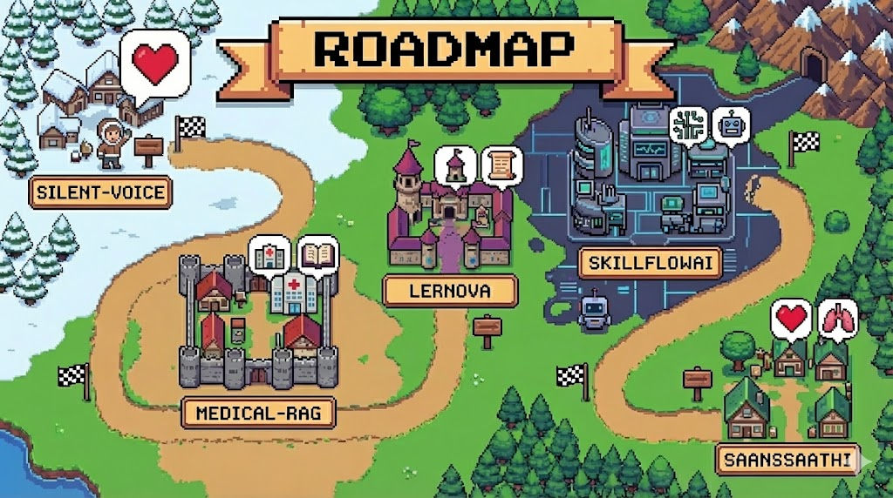

<table>
  <tr>
    <td width="120" align="center" valign="top">
      
    </td>
    <td align="center" valign="top">
      <h1>Hi 👋, I'm Ayushman</h1>
      
<b>CS Student at CMR College of Engineering and Technology</b>

      
    </td>
    <td width="180" align="center" valign="top">
      
      
Listening to: <i>Die with a Lappy</i>

    </td>
  </tr>
</table>

---

<table>
  <tr>
    <td width="55%" valign="top">
      <h3>🧰 Tech Stack</h3>
      

        
      

      <h3>✨ Skills</h3>
      <ul>
        <li>Backend Systems (APIs, DBs, Auth)</li>
        <li>Machine Learning (CV/NLP basics, experimentation)</li>
        <li>IoT + Computer Vision (sensors, pipelines)</li>
        <li>Product building (ship fast, iterate, learn)</li>
      </ul>
    </td>
    <td width="45%" valign="top">
      <h3>🚀 About Me</h3>
      
      <ul>
        <li>🎓 CS & Engineering student</li>
        <li>🧠 Passionate about <b>AI, Machine Learning, Backend Systems, IoT</b></li>
        <li>🛠 Building projects like <b>Silent-Voice</b> and civic-tech systems</li>
        <li>🎯 Goal: Build intelligent systems that genuinely help humanity</li>
      </ul>
    </td>
  </tr>
</table>

---

  

  

---

### 🌐 Connect With Me
- 💼 LinkedIn: www.linkedin.com/in/ayushman-yash-nayak-9485402a0
- 📫 Email: ayn250605@gmail.com

---

### 🧠 Philosophy I Code By
> "I'm not Lazy, I'm on energy saving mode"

- 🔭 I’m currently working on <b>Silent-Voice</b>
- 🌱 I’m currently learning <b>Machine Learning</b>
- 👯 I’m looking to collaborate on <b>Agentic AI</b>

